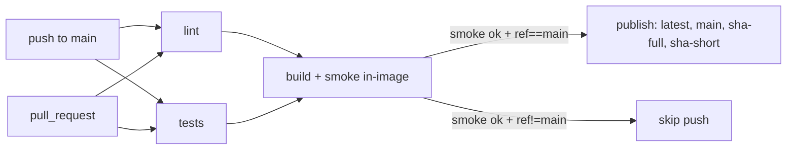

# Validator CI/CD — decisions and rationale

This document answers two questions an auditor asks when opening
[`.github/workflows/release.yml`](../.github/workflows/release.yml):

1. **Why this test stack and not another?**
2. **What is being tested and what was deliberately left out?**

The pipeline itself is the deliverable; here go the reasons that do not fit in YAML
comments.

Runtime rollout (Compose + Watchtower, readiness HTTP, epoch *safe points*)
is described separately in [README-DEPLOY.md](../README-DEPLOY.md).

---

## 1. Workflow triggers and structure



- `push: branches: [main]` — primary trigger: tests + build + push.
- `pull_request` — additional. PRs run lint + tests + build + smoke (no push).
  Cost is negligible thanks to `gha` cache and regressions show up before merge.
- `concurrency.cancel-in-progress: true` — force-push on a PR cancels the previous
  build instead of stacking jobs.
- `permissions: contents: read` — `GITHUB_TOKEN` at minimum scope. Pushes to
  Docker Hub use separate credentials (`secrets.DOCKERHUB_USERNAME` +
  `DOCKERHUB_TOKEN`), not the Actions token.

---

## 2. Test framework — chosen vs rejected

### 2.1 Test runner: **pytest**

**Why:**

- Standard in the Python ecosystem. GitHub’s native annotations plugin
  surfaces failures inline in the PR diff.
- Simple `assert` (no `self.assertEqual`), which keeps the `local_input` parser
  test a one-liner. Fixtures (`tmp_path`) make file I/O trivial.
- `parametrize` covers multiple sequence lengths without duplicated code —
  see [`tests/test_fasta.py`](../tests/test_fasta.py).
- `pytest-asyncio` is available if we later need to exercise `async` paths in
  the validator.

**Rejected — `unittest` (stdlib):** works, but verbose class-based API and weak
parametrization. “Zero install” is irrelevant because ruff is already a CI
dependency; one more package changes nothing.

**Rejected — `nose2`:** maintenance mode, shrinking ecosystem.

**Rejected — `tox` / `nox`:** orchestrators for Python version matrices. The image
pins Python 3.12. A matrix adds no value.

**Rejected — `Bazel` / `Pants`:** scale we do not need.

### 2.2 Lint/format: **ruff**

**Why:**

- Single Rust binary, whole-repo lint in <1s. Negligible CI cost.
- Replaces flake8 + isort + pyupgrade + part of pylint in one command.
- Configuration 100% via [pyproject.toml](../pyproject.toml). No extra files.
- Practical catches: dead imports, undefined names, obvious syntax errors —
  feedback in seconds before spending minutes on a heavy build.

**Concrete value when adopted:** running ruff on the repo for the first time
surfaced **3 latent bugs** (F821 — undefined name) that would eventually surface
as `AttributeError`/`NameError` at runtime if hit:

- `utils/challenge.py:137` — reference to `smiles` where the variable is `entry_id`.
- `utils/minmax_weighted_rank.py:86,93` — use of `bt.logging` without
  `import bittensor as bt`.

All three were fixed in the commit that introduced the pipeline.

**Rejected — flake8 + isort + black as three tools:** legacy flow, three configs,
three binaries, ~10× slower.

**Rejected — pylint:** too opinionated. Would emit hundreds of warnings on a
codebase not written for it. Tuning cost is high; ROI is low.

**Rejected — black alone:** formatter, not linter. Ruff already has an equivalent
`ruff format`; can be enabled later without switching tools.

**Deferred — mypy / pyright:** the code has almost no type annotations. Mypy would
add noise for little real signal. Defer until typing becomes an explicit goal.

### 2.3 Dockerfile lint (hadolint) — deferred

Useful and cheap (~5s, single binary). Not required by the task and the Dockerfile
already had manual review. Marked as a low-cost follow-up.

### 2.4 Image CVE scan (Trivy / Docker Scout) — deferred

Production concern (compliance, supply chain). Not requested. Defer until there is
a defined patching policy — otherwise scans become ticket noise.

### 2.5 Property-based / mutation testing (Hypothesis, mutmut) — deferred

Overkill for the testable surface. Maintenance cost > value added.

---

## 3. What is tested — two layers

The central constraint is structural: most validator modules do
`import bittensor as bt` at file top, and
[`utils/__init__.py`](../utils/__init__.py) re-exports everything. Importing anything
from `utils.*` outside Docker forces installing the full stack
(bittensor + torch + boltz + boltzgen + ...) — expensive and brittle in CI.

Hence the deliberate split:

### Layer A — **outside Docker, fail-fast (~30s)**

| Test | What it actually catches |
| --- | --- |
| `ruff check` on `tests/` + `utils/{fasta,local_input,files}.py` (phase 1; see Sec. 8) | Unused imports, syntax errors and similar **within** the CI/task scope — does not force lint on all legacy code until phase 2 (`ruff check .`). |
| [`tests/test_fasta.py`](../tests/test_fasta.py) | Round-trip `read_fasta`/`write_fasta` ([utils/fasta.py](../utils/fasta.py)); header with metadata, multiline sequence (80-column wrap), empty file, blank lines mid-file, boundary lengths (0/1/79/80/81/…). |
| [`tests/test_local_input.py`](../tests/test_local_input.py) | Parser for `uid\|mols\|seqs` ([utils/local_input.py](../utils/local_input.py)) — used by `make run-local`. Covers: basic line, single-item, trailing commas, non-integer uid, wrong field count, and round-trip against the versioned `example_local_input` file. |
| [`tests/test_workflow_yaml.py`](../tests/test_workflow_yaml.py) | Guards against pipeline regressions: jobs present, correct `needs`, smoke before push, mandatory tags `latest`/`main`/sha-full/sha-short, `permissions: contents: read`, `concurrency.cancel-in-progress`. |

**Minimal refactor required:** the pure parsers (FASTA and local input) lived in
`utils/files.py`, which imports `bittensor` and `dotenv` at top level. They were
extracted into [`utils/fasta.py`](../utils/fasta.py) and
[`utils/local_input.py`](../utils/local_input.py) — pure stdlib modules —
preserving 100% of the public API (`utils.files` still re-exports the old symbols;
`utils.read_local_input_file` still exists).

Tests load those modules via `importlib.util.spec_from_file_location` in
[`tests/conftest.py`](../tests/conftest.py), bypassing `utils/__init__.py` so
pytest finishes in ~250ms on a standard runner without installing the heavy stack.

### Layer B — **inside Docker, post-build smoke (~10s, real gate)**

Runs **after** `docker buildx build --load` and **before** any `docker push`.
If either step fails, push does not happen.

| Test | What it actually catches |
| --- | --- |
| `python -c "import neurons.validator.validator"` | Any broken import anywhere in the real validator tree: missing dependency in `requirements.txt`, moved module without import fix, version clash among boltz/boltzgen/bittensor/torch after a bump, broken `__init__.py`, bad `PYTHONPATH` in the Dockerfile `ENV`. **This is the single most valuable test in the pipeline** — it validates the artifact going to the Hub. |
| `command -v mmseqs && command -v igblastn` | Final `ENV` `PATH` keeps external tools. Silent regressions are common when refactoring Dockerfiles. |

The philosophy: **test the artifact you publish.** Outside-Docker unit tests give
fast feedback on a tiny slice; in-image smoke validates what end users pull from
the Hub.

---

## 4. Deliberately out of scope

| Category | Concrete example | Why deferred |
| --- | --- | --- |
| **Chain (subtensor RPC)** | `connect_subtensor`, `set_weights`, `check_registration` | Logic is a thin `bittensor` wrapper. Mocking the whole library is costly with low payoff (bugs usually show as obvious connectivity failures, not subtle regressions). Testing against testnet couples CI to external infra. |
| **Inference (boltz/boltzgen)** | `inference.main(...)`, `BoltzgenWrapper.finalize_from_shared_components` | Requires GPU. Free-tier GHA runners do not have one. A real run takes minutes. Code is upstream — we wrap models, we did not author them. |
| **Epoch end-to-end** | Full `process_epoch(...)` | Combines chain + inference + GPU + submission corpus. Impractical in CI. Fits an overnight cron on a GPU runner, not every push. |
| **Timelock / drand** | `QuicknetBittensorDrandTimelock` | External network call. Mocking = testing the mock. Upstream library. |
| **Type checking** | mypy / pyright | Codebase barely annotated. Output would be all noise or silence. Defer until typing is policy. |
| **Coverage gate** | `--cov-fail-under=80` | With such a small suite, coverage % is a misleading signal. Becomes metric theater. Do not measure what cannot be defended. |
| **Multi-arch image** | `linux/arm64` | Dockerfile uses CUDA + x86_64 binaries (mmseqs, igblast). An arm64 image would not run. |
| **Dockerfile lint** | hadolint | Cheap but outside the stated scope. Suggested follow-up. |
| **Image CVE scan** | Trivy, Docker Scout | Production/compliance concern, not requested. |

---

## 5. Tagging

`docker/metadata-action@v5` emits, on every push to `main`:

- `latest` — mutable pointer to `main` HEAD. Good for “pull current version”.
- `main` — mirrors `latest` while there is only one release branch. Kept by
  agreement with requirements and to leave room for a future `release-X.Y`.
- `sha-<full-40>` and `sha-<short-7>` — immutable, auditable. Rollback policy is
  “pin exact SHA”; full hash for strict validation tooling, short for humans in
  logs.

No `:vX.Y.Z` yet — this subnet does not have a stabilized release cadence. When it
does, add one more line under `tags:` (`type=semver`).

---

## 6. Cache and cost

Without cache, the build weighs ~30 minutes on a standard GHA runner (CUDA base,
MMseqs, IgBLAST, HF dataset, torch+cu126, boltz/boltzgen, Rust + maturin for
timelock).

With `cache-from/to: type=gha,scope=validator,mode=max`, subsequent builds touch
only affected layers (usually final `COPY . .` + reinstall boltz/boltzgen if those
dirs change). Typically ~3–5 minutes.

`mode=max` stores all intermediate layers. It uses GHA cache storage but avoids
cascading partial rebuilds. GHA cache is free up to 10 GB per repo; ours likely
stays well below that.

---

## 7. Roadmap — not here yet but mapped

Documented to close “why not X” without ambiguity:

- **`hadolint`** in the `lint` job (Dockerfile style).
- **`ruff format`** enabled in CI (auto-format + check).
- **Trivy/Grype** image scan before push.
- **`pytest-cov`** once the suite covers more business logic (without broad
  coverage now, a gate would be theater).

Each item lands when ROI turns positive, not because “respectable CI must have X”.

---

## 8. Local commands (aligned with CI)

### Lint — phase 1 (current) vs phase 2 (planned)

**Phase 1 (soft):** the CI `lint` job and `make lint*` targets in the [Makefile](../Makefile)
**do not** run `ruff check .` on the entire repository. They run only on what the
CI task touched and the test suite, to avoid forcing mass `make lint-fix` on
legacy code:

```text
tests/ utils/fasta.py utils/local_input.py utils/files.py neurons/validator/lifecycle.py
```

Rules (`E`, `F`, `W`, ignores, excludes under `external_tools/` / vendor) remain
defined in [`pyproject.toml`](../pyproject.toml) — only the command **target**
changes.

**Phase 2 (strict):** a later commit should switch the workflow and Makefile to
`ruff check .` (repo root), run `lint-fix` / `lint-fix-unsafe` where appropriate,
and only then expand the gate to neuron/validator/, `auto_updater.py`, etc.

After dropping a commit that was only automatic lint fixes for phase 2, you can
**re-apply** fixes using the same targets CI uses at that time.

| Command | CI equivalent (phase 1) | Effect |
| --- | --- | --- |
| `make lint` | job `lint` → `ruff check tests/ utils/fasta.py …` | Check only; does not modify files. |
| `make lint-fix` | — (CI does not write fixes) | `ruff check … --fix` — **safe** fixes within the same scope. |
| `make lint-fix-unsafe` | — | `… --unsafe-fixes` — includes *unsafe* fixes (e.g. whitespace in docstrings). |
| `make test` | job `tests` → `pytest tests/` | Runs the suite under [`tests/`](../tests/). |

**Overrides:** `make lint RUFF_TARGETS="tests/"` lints only `tests/` without editing the Makefile.

**Prerequisites** (`make` error messages say the same):

- `pip install ruff==0.7.4` — version pinned in
  [`.github/workflows/release.yml`](../.github/workflows/release.yml) (`RUFF_VERSION` in the [Makefile](../Makefile) must match).
- `pip install pytest pyyaml` — for `make test`.

The `lint` / `lint-fix` targets `cd` to the Makefile directory before invoking
Ruff — equivalent to paths relative to the `nova/` root in CI.

---

## 9. GitHub configuration checklist

Before the first merge to `main`:

- `secrets.DOCKERHUB_USERNAME` — string, e.g. `your-dockerhub-user`.
- `secrets.DOCKERHUB_TOKEN` — Docker Hub access token with **Read & Write** scope
  (**not** the account password). Create at
  https://hub.docker.com/settings/security.
- (optional) `vars.IMAGE_NAME` — image name on the Hub. Default: `nova-validator`.

On PRs and on pushes that are not `main`, login + push steps are gated with
`if: github.event_name == 'push' && github.ref == 'refs/heads/main'`.
So if secrets are not configured yet when a PR runs, nothing breaks.
